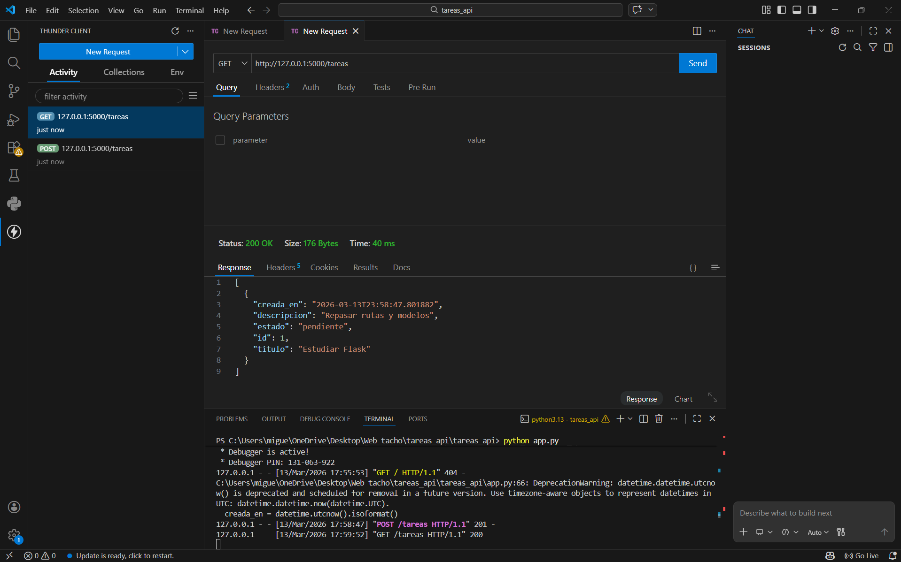
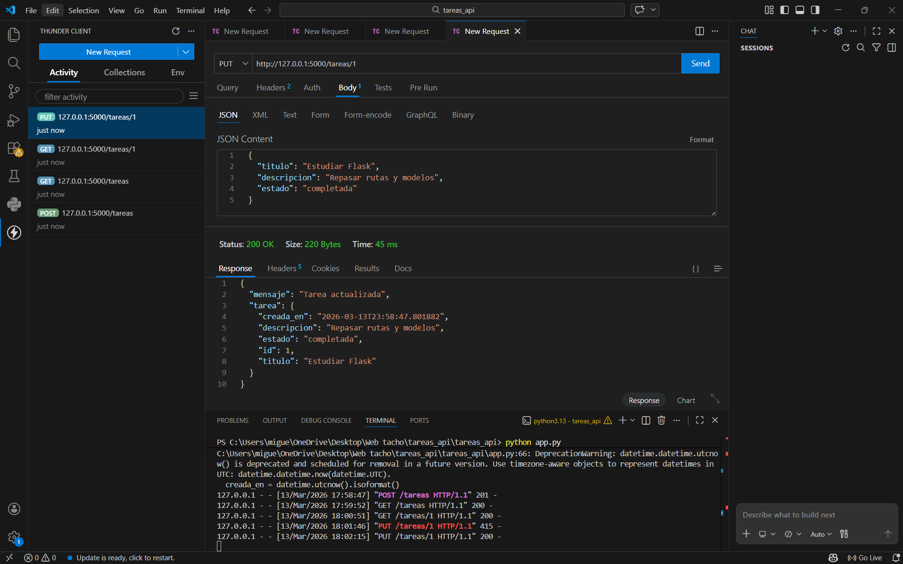

# Actividad 3.8 — API REST para Gestión de Tareas

API REST desarrollada con **Flask** y **SQLite** que implementa un CRUD completo para administrar tareas personales.

---

## Tecnologías utilizadas

- Python 3
- Flask
- SQLite3

---

## Endpoints implementados

| Método   | Endpoint          | Descripción              | Código |
|----------|-------------------|--------------------------|--------|
| `POST`   | `/tareas`         | Crear una nueva tarea    | 201    |
| `GET`    | `/tareas`         | Listar todas las tareas  | 200    |
| `PUT`    | `/tareas/<id>`    | Actualizar una tarea     | 200    |
| `DELETE` | `/tareas/<id>`    | Eliminar una tarea       | 200    |

---

## Estructura de una tarea

```json
{
  "id": 1,
  "titulo": "Estudiar Flask",
  "descripcion": "Repasar rutas y blueprints",
  "estado": "pendiente",
  "creado_en": "2025-03-19 10:00:00"
}
```

**Estados válidos:** `pendiente` · `en_progreso` · `completada`

---


## Evidencias

### Listado completo de tareas — `GET /tareas`



---

### Crear tarea — `POST /tareas`


---

### Actualizar tarea — `PUT /tareas/<id>`



---

### Eliminar tarea — `DELETE /tareas/<id>`


---

### Vista individual de tarea — `GET /tareas/<id>`


---

## Autor

**ManuelTavares-sudo** — Actividad 3.8 · Aplicaciones Web Orientadas a Servicios
